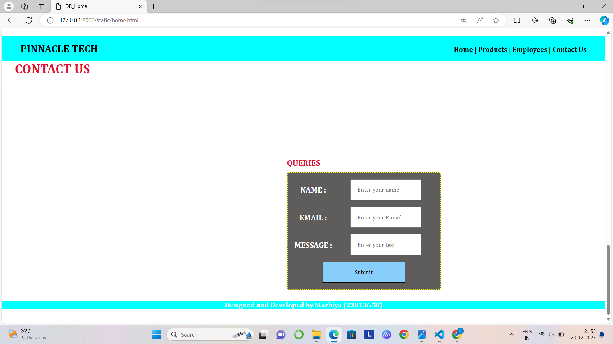

# Ex.07 Software Product Company Website
## Date:20-12-2023

## AIM:
To develop a static company website to display the softwares and services provided by the company.

## DESIGN STEPS:

### Step 1:
Requirement collection.

### Step 2:
Creating the layout using HTML and CSS.

### Step 3:
Updating the sample content.

### Step 4:
Choose the appropriate style and color scheme.

### Step 5:
Validate the layout in various browsers.

### Step 6:
Validate the HTML code.

### Step 7:
Publish the website in the given URL.

## PROGRAM:
```
<!DOCTYPE html>
<html lang="en">
<head>
    <meta charset="UTF-8">
    <meta name="viewport" content="width=device-width, initial-scale=1.0">
    <title>DD_Home</title>
    <style>
        *{
            margin:0;
            padding:0
        }
        #nav{
            background-color:cyan;
            color:white;
            padding: 15px;
    
        }
        li,h1,ul{
            display:inline;
        }
        ul{
            margin-left:60%;
        }
        a{
            color:black;
            text-decoration: none;
        }
        a:hover{
            color:white;
            cursor:pointer;
        }
        input{
            width: 60%;
            padding: 15px;
        }
            .searchbar{
            padding:50px;
            text-align: center;
        }
        
        .box {
            display:inline-block;
            border-style:dotted ;
            border-radius: 10px;
            border-color: rgb(224, 17, 51);
            width: 400px;
            min-height: 300px;
            font-size: 20px;
            background-color:teal;
        
        }
        .heading1{
            color:black;
            text-align: center;
            padding-top: 20px;
        }
        .heading2{
            color:rgb(224, 17, 51);
            text-align: justify;
            font-size: 30px;
            margin-left: 30px;
        }
        .edge{
            padding-left: 900px;
        }
        .box{
            text-align: center;
        }
        .bottomdiv{
            background-color:cyan;
            color:white;
            text-align: center;
            position:relative;
            display:block;
            margin-top: 150px;

        }
        table{
           
            margin-left: 50px;
        }
    </style>
</head>
<body background="webcover2.jpg">
    <div class="header">
        <nav id="nav">
            <h1>
                PINNACLE TECH
            </h1>
                <ul>
                    <li class="li1"> 
                        <a href="home1.html" target="_blank">Home  |</a>
                    </li>
                    <li class="li2"> 
                        <a href="Products.html" target="_blank">Products  |</a>
                    </li>
                    <li class="li4"> 
                        <a href="person.html" target="_blank">Employees  |</a>
                    </li>
                    <li class="li5"> 
                        <a href="contactus.html" target="_blank">Contact Us</a>
                    </li>
                </ul>
        </nav>
    </div>
    <div class="searchbar">
    <input placeholder="search">
    </div>
        <div><pre class="heading2"><i><b>
"Crafting digital dreams into
tangible gadgets – we transform 
ideas into innovation."<b></i></pre></div>
        <div class="edge">
            <div class="box">
            <h1 class="heading1">LOGIN HERE</h1>
            <br>
            <br>
            <form>
                <table cellpadding="15px" cellspacing="15px">
                    <tr>
                        <td>
                            Username:
                        </td>
                        <td>
                            <input type="email" name="name" placeholder="Enter a Email">
                        </td>
                    </tr>
                    <tr>
                        <td>
                            Password:
                        </td>
                        <td>
                            <input type="password" name="pwd" placeholder="Enter a Password">
                        </td>
                    </tr>
                    <tr>
                        <td colspan="2">
                            <input type="submit" value="LOGIN" style="background-color: black; color:aqua;">
                        </td>
                    </tr>
                </table>
                
            </form>
            </div>
        </div>
    <div class="bottomdiv">
        <p>Designed and Developed by Starbiya(23013658)</p>
    </div>
</body>
<html>

Products.html

<!DOCTYPE html>
<html lang="en">
<head>
    <meta charset="UTF-8">
    <meta name="viewport" content="width=device-width, initial-scale=1.0">
    <title>DD_Products</title>
    <style>
        *{
            margin:0;
            padding:0;
            font-family:Cambria, Cochin, Georgia, Times, 'Times New Roman', serif;
        }
        #nav{
            background-color:cyan;
            color:white;
            padding: 15px;
    
        }
        li,.heading1,ul{
            display:inline;
        }
        ul{
            margin-left:60%
        }
        li{
            color:black;
        }
        li:hover{
            color:white;
            cursor:pointer;
        }
        input{
            width: 60%;
            padding: 15px;
        }
            .searchbar{
            padding:50px;
            text-align: center;
        }
        .box{
            border-color:black;
            border-width:2px;
            border-style:solid;
            display: inline-block;
            width: 414px;
        }
        .product{

            text-align: center;
        }
        .box{
            background-color:cyan;
            cursor:pointer;
        }
        a{
            color:black;
            text-decoration: none;
        }
        a:hover{
            color:white;
            cursor:pointer;
        }
        .heading2{
            padding-top: 100px;
            padding-bottom: 10px;
            text-align: center;
            color:rgb(224, 17, 51);
        }
        .bottomdiv{
            background-color:cyan;
            color:white;
            text-align: center;
            position:relative;
            display:block;
            margin-top: 56px;

        }
    </style>
</head>
<body background="webcover2.jpg">
    <div class="header">
        <nav id="nav">
            <h1 class="heading1">PINNACLE TECH</h1>
                <ul>
                    <li class="li1"> 
                        <a href="home1.html" target="_blank">Home  |</a>
                    </li>
                    <li class="li2"> 
                        <a href="Products.html" target="_blank">Products  |</a>
                    </li>
                    <li class="li4"> 
                        <a href="person.html" target="_blank">Employees  |</a>
                    </li>
                    <li class="li5"> 
                        <a href="contactus.html" target="_blank">Contact Us</a>
                    </li>
                </ul>
            </nav>
        </div>
        <h1 class="heading2">PRODUCTS</h1>
        <br>
        <div class="product">
            <div class="box">
                
                <h1>GLIDEMASTER PRO MOUSE</h1>
                <p>Elevate your productivity with the GlideMaster Pro Mouse, featuring precision tracking, customizable buttons, and a sleek ergonomic design for comfortable use.A cutting-edge ergonomic mouse designed for seamless navigation and enhanced productivity, featuring customizable buttons and precision tracking.
                </p>
            </div>
            <div class="box">
               
                <h1>QUICKCHARGE POWER BANK</h1>
                <p>Stay powered on the move with our QuickCharge Power Bank, providing high-capacity charging for smartphones, tablets, and other USB-powered devices.Charge your devices effortlessly with the EcoFlow Wireless Charging Pad, offering fast and convenient charging for smartphones, tablets, and more.</p>
            </div>
            <div class="box">
                
                <h1>PURE SOUND BLUETOOTH HEADPHONES</h1>
                <p>Immerse yourself in superior audio quality with PureSound Bluetooth Headphones, offering crisp sound, noise isolation, and a comfortable over-ear design. Immerse yourself in superior sound quality and hassle-free connectivity with our SwiftConnect earbuds, delivering a seamless audio experience.
                </p>
            </div>
        </div>
    </div>
    <div class="bottomdiv">
        <p>Designed and Developed by Starbiya(23013658)</p>
    </div>
</body>
</html>

person.html

<!DOCTYPE html>
<html lang="en">
<head>
    <meta charset="UTF-8">
    <meta name="viewport" content="width=device-width, initial-scale=1.0">
    <title>DD_Employees</title>
    <style>
        *{
            margin:0;
            padding:0;
            font-family:Cambria, Cochin, Georgia, Times, 'Times New Roman', serif;
        }
        #nav{
            background-color:cyan;
            color:black;
            padding: 15px;
    
        }
        li,.heading1,ul{
            display:inline;
        }
        ul{
            margin-left:60%
        }
        li{
            color:black;
        }
        li:hover{
            color:black;
            cursor:pointer;
        }
        input{
            width: 60%;
            padding: 15px;
        }
        a{
            color:black;
            text-decoration: none;
        }
        a:hover{
            color:white;
            cursor:pointer;
        }
        .heading2{
            padding-top: 100px;
            padding-bottom: 10px;
            text-align: center;
            color:rgb(224, 17, 51);
        }
        .bottomdiv{
            background-color:cyan;
            color:white;
            text-align: center;
            position:relative;
            display:block;
            margin-top: 163px;

        }
        img{
            border-radius: 50%;
            width: 200px;
            display: inline;
            padding:3px;
            
        }
        .person{
            margin:100px;
            text-align: center;
        }
        b,p{
            color:white;
            text-align: center;
        }
    </style>
</head>
<body background="webcover2.jpg">
    <div class="header">
        <nav id="nav">
            <h1 class="heading1">PINNACLE TECH</h1>
                <ul>
                    <li class="li1"> 
                        <a href="home1.html" target="_blank">Home  |</a>
                    </li>
                    <li class="li2"> 
                        <a href="Products.html" target="_blank">Products  |</a>
                    </li>
                    <li class="li4"> 
                        <a href="person.html" target="_blank">Employees  |</a>
                    </li>
                    <li class="li5"> 
                        <a href="contactus.html" target="_blank">Contact Us</a>
                    </li>
                </ul>
            </nav>
        </div>
        <h1 class="heading2">EMPLOYEES</h1>
        <table class="person">
            <tr>
                <td>
                    
                </td>
                <td>
                    
                </td>
                <td>
                    
                </td>
                <td>
                    
                </td>
                <td>
                    
                </td>
                <td>
                    
                </td>
            </tr>
            <tr>
                <td>
                    <b>Starbiya</b>
                    <p>CEO</p>
                </td>
                <td>
                    <b>Vijay</b>
                    <p>CEO,Co-Founde</p>
                </td>
                <td>
                    <b>Saipallavi</b>
                    <p>CTO,Co-Founder</p>
                </td>
                <td>
                    <b>Sidsriram</b>
                    <p>CEODirector</p>
                </td>
                <td>
                    <b>Anupama</b>
                    <p>Asst.Director</p>
                </td>
                <td>
                    <b>Kalyani</b>
                    <p>Dy.Director</p>
                </td>
            </tr>
        </table>
    </div>
    <div class="bottomdiv">
        <p>Designed and Developed by Starbiya(23013658)</p>
    </div>
</body>
</html>

contactus.html

<!DOCTYPE html>
<html lang="en">
<head>
    <meta charset="UTF-8">
    <meta name="viewport" content="width=device-width, initial-scale=1.0">
    <title>DD_Contactus</title>
    <style>
        *{
            margin:0;
            padding:0;
            font-family:Cambria, Cochin, Georgia, Times, 'Times New Roman', serif;
        }
        #nav{
            background-color:cyan;
            color:white;
            padding: 15px;
    
        }
        li,.heading1,ul{
            display:inline;
        }
        ul{
            margin-left:60%
        }
        li{
            color:black;
        }
        li:hover{
            color:white;
            cursor:pointer;
        }
        input{
            width: 60%;
            padding: 15px;
        }
            .searchbar{
            padding:50px;
            text-align: center;
        }
        .box{
            border-color:black;
            border-width:2px;
            border-style:solid;
            display: inline-block;
            width: 414px;
        }
        .product{

            text-align: center;
        }
        .box{
            background-color:cyan;
            cursor:pointer;
        }
        a{
            color:black;
            text-decoration: none;
        }
        a:hover{
            color:white;
            cursor:pointer;
        }
        .heading2{
            padding-top: 100px;
            padding-bottom: 10px;
            text-align: center;
            color:rgb(224, 17, 51);
        }
        .table1{
            color:white;
            font-size: large;
        }
        .contactus{
            margin-left:400px;
        }
        .heading3{
            padding-top: 30px;
            padding-bottom: 10px;
            text-align: center;
            color: rgb(224, 17, 51);
        }
        .table2{
            color:white;
            font-size: large;
            background-color:rgb(95, 92, 92);
            border-radius: 5px;
            border-style:dotted;
            border-color: yellow;

        }
        .queries{
            margin-left:600px;
        }
        .bottomdiv{
            background-color:cyan;
            color:white;
            text-align: center;
            position:relative;
            display:block;
            margin-top: 24px;

        }
    </style>
</head>
<body background="webcover2.jpg">
    <div class="header">
        <nav id="nav">
            <h1 class="heading1">PINNACLE TECH</h1>
                <ul>
                    <li class="li1"> 
                        <a href="home1.html" target="_blank">Home  |</a>
                    </li>
                    <li class="li2"> 
                        <a href="Products.html" target="_blank">Products  |</a>
                    </li>
                    <li class="li4"> 
                        <a href="person.html" target="_blank">Employees  |</a>
                    </li>
                    <li class="li5"> 
                        <a href="contactus.html" target="_blank">Contact Us</a>
                    </li>
                </ul>
            </nav>
        </div>
        <h1 class="heading2">CONTACT US</h1>
        <div class="contactus">
            <table cellpadding="15px" cellspacing="15px" class="table1">
                <tr>
                    <td>
                        ADDRESS :
                    </td>
                    <td>
                       11/11 Soosaiyapper street, Kurumpanai,Kanyakumari 629251.
                    </td>
                </tr>
                <tr>
                    <td>
                        LANDMARK :
                    </td>
                    <td>
                        near Colachel,Kurumpanai bus stand.
                    </td>
                </tr>
                <tr>
                    <td>
                        Email :
                    </td>
                    <td>
                        pinanacletech@gmai.com
                    </td>
                </tr>
                <tr>
                    <td>
                        PHONE :
                    </td>
                    <td>
                        9532134950
                    </td>
                </tr>
            </table>
        </div>
        <div>
            <h3 class="heading3">QUERIES</h3>
            <div class="queries">
                <table cellpadding="15px" cellspacing="15px" class="table2">
                    <tr>
                        <td>
                            NAME :
                        </td>
                        <td>
                            <input type="name" placeholder="Enter your name"> 
                        </td>
                    </tr>
                    <tr>
                        <td>
                            EMAIL :
                        </td>
                        <td>
                            <input type="email" placeholder="Enter your E-mail">
                        </td>
                    </tr>
                    <tr>
                        <td>
                            MESSAGE :
                        </td>
                        <td>
                            <input type="text" placeholder="Enter your text">
                        </td>
                    </tr>
                    <tr>
                        <td colspan="2">
                            <input type="submit" style="background-color: lightskyblue; color: black;">
                        </td>
                    </tr>
            </table>
        </div>
        <div class="bottomdiv">
            <p>Designed and Developed by Starbiya (23013658)</p>
        </div>
    </div>
</body>
</html>

```


## OUTPUT:

[
Alt text](<Screenshot 2023-12-20 214754.png>)


## RESULT:
The program for designing software company website using HTML and CSS is completed successfully.
